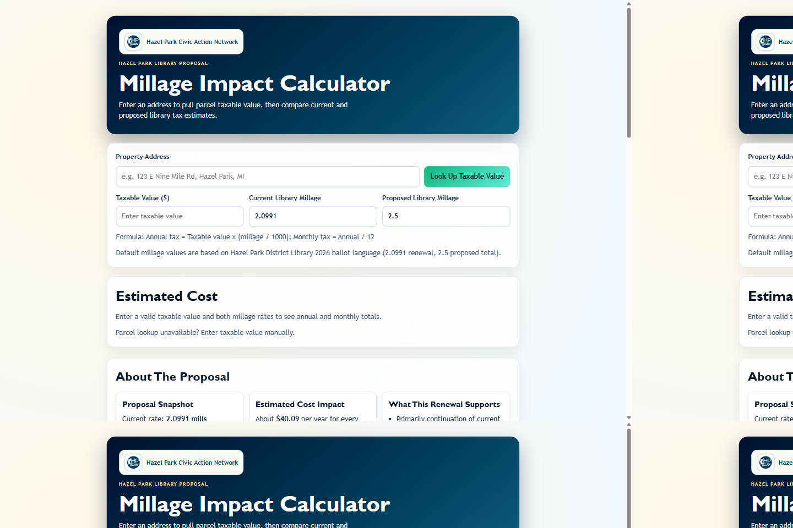

# Hazel Park Library Millage Calculator

Simple React + TypeScript app for showing what a proposed library millage means for a resident using taxable value.

## Production Site

- Live URL: https://d1t4mo5gpo642l.cloudfront.net/

## Screenshots


## What it does

- Lets users enter a property address and request parcel lookup.
- Pulls taxable value from a configured parcel API endpoint.
- Shows current vs proposed tax and the difference by year and month.

## Local setup

1. Install dependencies:

```bash
npm install
```

2. Create a `.env` file in project root with the Oakland County, Michigan parcel endpoint:

```bash
VITE_OAKLAND_PARCEL_API_URL=https://gisservices.oakgov.com/arcgis/rest/services/Enterprise/EnterpriseOpenParcelDataMapService/MapServer/1
VITE_GOOGLE_GEOCODING_API_KEY=your_google_api_key_here
VITE_GOOGLE_GEOCODING_REGION=us
```

The app queries this ArcGIS layer by `SITEADDRESS` and reads `TAXABLEVALUE` (fallback `ASSESSEDVALUE`).
If `VITE_GOOGLE_GEOCODING_API_KEY` is set, it first normalizes the entered address through Google Geocoding and attempts a point-based parcel lookup before text fallback.

### Optional: Set Up Google Geocoding API Key

1. Open [Google Cloud Console](https://console.cloud.google.com/) and create/select a project.
2. Enable billing for the project (required by Google Maps Platform).
3. Enable the Geocoding API:
	- APIs & Services -> Library -> Geocoding API -> Enable
4. Create an API key:
	- APIs & Services -> Credentials -> Create credentials -> API key
5. Restrict the key (recommended):
	- Application restrictions: `HTTP referrers (web sites)`
	- Add allowed origins, for example:
	  - `http://localhost:5173/*`
	  - `https://d1t4mo5gpo642l.cloudfront.net/*`
	  - your custom domain if used
	- API restrictions: `Restrict key` -> `Geocoding API`
6. Add the key to your `.env`:

```bash
VITE_GOOGLE_GEOCODING_API_KEY=your_google_api_key_here
VITE_GOOGLE_GEOCODING_REGION=us
```

7. Restart the dev server after updating `.env`.

Security note: Vite `VITE_` variables are bundled client-side, so keep key restrictions enabled.

3. Start development server:

```bash
npm run dev
```

## Build

```bash
npm run build
```

## Deploy To AWS With Terraform

This repo includes Terraform in [infra/terraform/main.tf](infra/terraform/main.tf) to host the site with:

- S3 (private bucket)
- CloudFront (public CDN)
- Origin Access Control (CloudFront -> S3)
- Optional Route53 alias records for custom domains

### 1. Build the app

```bash
npm run build
```

### 2. Configure Terraform variables

```bash
cd infra/terraform
cp terraform.tfvars.example terraform.tfvars
```

If you want a custom domain, set `domain_names`, `acm_certificate_arn` (in us-east-1), and optionally Route53 settings.

### 3. Deploy

```bash
terraform init
terraform plan
terraform apply
```

Or run the full build + apply + CloudFront invalidation flow from project root:

```bash
npm run deploy
```

To wait until CloudFront invalidation is fully completed before exit:

```bash
npm run deploy:wait
```

### 4. Get the URL

Terraform outputs include:

- `site_url`
- `cloudfront_domain_name`

### 5. Add an HPCAN Subdomain Without Disrupting Current URL

This keeps the existing CloudFront URL active while adding a friendly custom subdomain.

1. Request or import an ACM certificate in `us-east-1` for your target subdomain (for example `libraryrenewal.hpcan.org`).

2. In `infra/terraform/terraform.tfvars`, set:

```hcl
domain_names            = ["libraryrenewal.hpcan.org"]
acm_certificate_arn     = "arn:aws:acm:us-east-1:YOUR_ACCOUNT_ID:certificate/YOUR_CERT_ID"
create_route53_records  = false
route53_zone_id         = null
```

3. Validate the ACM certificate using the DNS CNAME records ACM provides.

4. Deploy AWS changes:

```bash
npm run deploy:wait
```

5. At your DNS provider, create a CNAME for the subdomain that points to Terraform output `cloudfront_domain_name`.

6. Verify both URLs:
	- Custom subdomain URL
	- Existing CloudFront URL (should still work)

Note: even with external DNS, the certificate still needs to exist in your AWS account (ACM in `us-east-1`) because CloudFront uses ACM certificates from AWS.

### Notes

- AWS credentials must be configured in your shell before running Terraform.
- The default `site_content_path` is `../../dist` (Vite build output).
- When you rebuild the app, rerun `terraform apply` to upload changed assets.
- `npm run deploy` automatically builds, applies Terraform, and invalidates CloudFront.
- `npm run deploy:wait` does the same and waits for invalidation status `Completed`.
